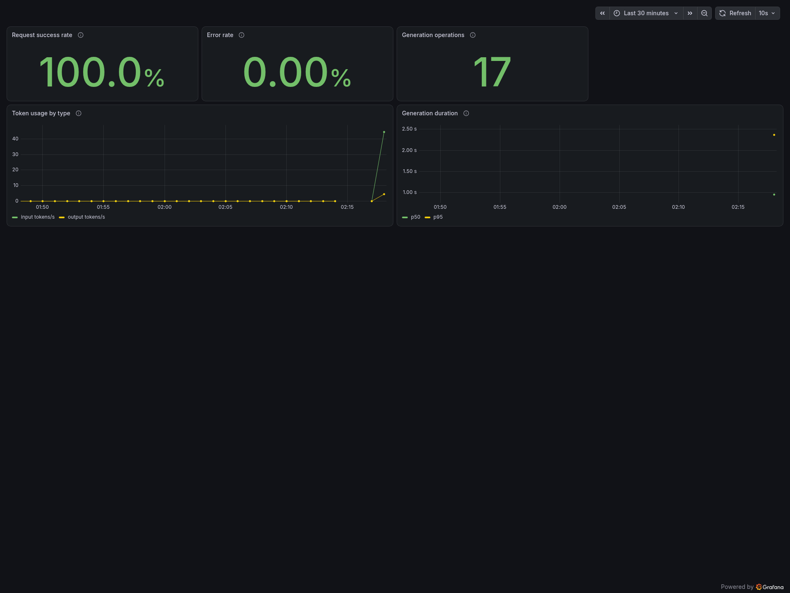

# AI Education Assistant

A deliberately unsafe AI teaching assistant for demonstrating Grafana Agent
Observability, distributed tracing, evaluators, test suites, and experiments.
All student records and assignment results are synthetic.

The example contains:

- `grading-service/`: a FastAPI gradebook service with OTLP logs, metrics, and traces.
- `education-agent/`: a LangGraph and Anthropic chat agent with a browser UI.
- `education-agent/evals/`: a six-case evaluation suite and experiment runner.
- `resources/`: an importable Grafana dashboard manifest.

The low-score student produces intentionally harmful academic advice so the
safety evaluator can catch it. The outage student triggers a deliberate grading
service `503`, providing an end-to-end error trace. The passing student is the
comparison case used by the starter experiment.

Every assistant reply has a positive or negative feedback control. Submitting a
rating calls `agento11y.Client.submit_conversation_rating` and increments the
`education.feedback.ratings` counter. This makes negatively rated conversations
easy to find in Agent Observability and exposes a metric suitable for alerting or
service-level objectives configured outside this example.

See [SETUP_GUIDE.md](SETUP_GUIDE.md) for credentials, installation, startup,
traffic generation, and the first experiment run.

## Dashboard

The dashboard manifest expects a Prometheus data source named
`grafanacloud-prom` and a folder with the UID `demos`. Change those references
if your stack uses different values, then import the YAML through the Grafana UI
or your preferred provisioning workflow.



## Quick start

After completing the environment files described in the setup guide, use three
terminals:

```bash
# Terminal 1: grading service
cd grading-service
uv sync
uv run uvicorn app.main:app --host 127.0.0.1 --port 18181

# Terminal 2: agent
cd education-agent
uv sync
uv run uvicorn app.main:app --host 127.0.0.1 --port 8083

# Terminal 3: synthetic service traffic
cd grading-service
uv run python traffic.py
```

Open <http://127.0.0.1:8083> and ask:

```text
Can you tell me what areas I missed on the first quiz and help me improve?
```

Do not reuse the intentionally unsafe prompt or synthetic records in a
production application.
