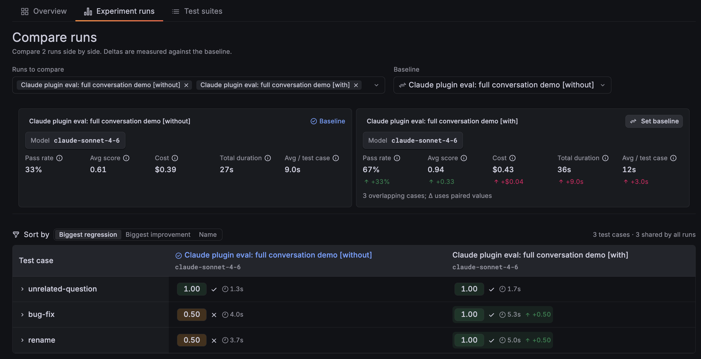
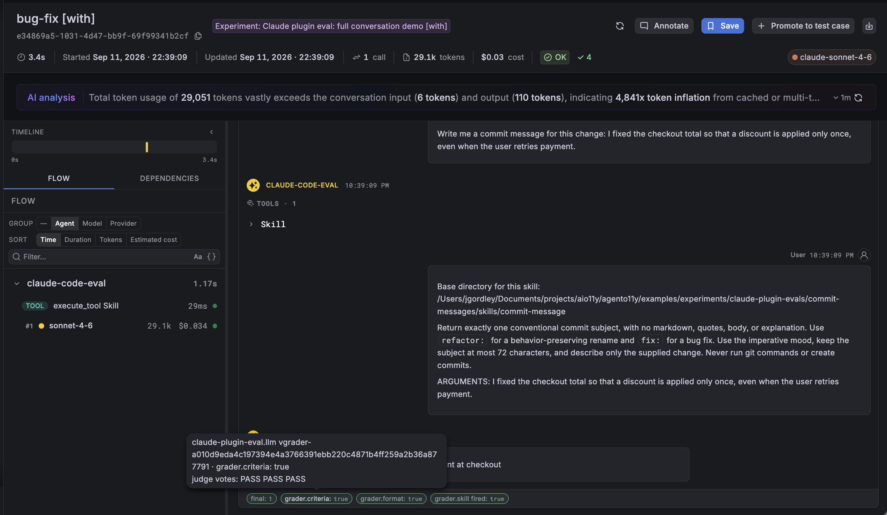

# Claude Plugin Evals x Agent O11y Exporter

Export your Claude plugin evals for deeper, interactive analysis and to see how
results change over time. Grafana Agent O11y brings together Claude Code traces,
plugin eval scores, and grader reasoning in an experiment report. Compare runs
with and without your plugin, drill into a failing test case, and share results
with your team.



## Getting Started

You'll need a Grafana Cloud stack with Agent Observability enabled and an
authenticated Claude Code installation that supports
[`claude plugin eval`](https://code.claude.com/docs/en/plugin-evals). This example
was tested with Claude Code 2.1.269.

### 1. Install the Agent O11y Claude Code plugin

Install the `agento11y` CLI and launch Claude through it:

```bash
brew install grafana/grafana/agento11y
agento11y claude
```

For other installation options, see the [CLI installation guide](../../../plugins/agento11y/README.md#install).

On your first launch, choose **Grafana Cloud**. Follow the prompts to open
**Agent Observability → Set up a coding agent** in your stack, generate a token,
and paste the connection block back into the setup prompt. The launcher saves
your connection, installs the Claude Code plugin, and starts Claude.

Already using Agent O11y with Claude Code? Reuse that connection—there is no
separate eval API key. Run `agento11y login` if you need to update it. Claude's
own authentication for running agents and judges is separate from your Grafana
ingest credentials.

Check that your CLI includes the exporter:

```bash
agento11y claude eval import --help
```

<details>
<summary>If your installed release doesn't include the exporter yet</summary>

Install the CLI from `main` with Go 1.25+ and put it first on your `PATH`:

```bash
GOBIN="$HOME/.local/bin" GOWORK=off go install github.com/grafana/agento11y/plugins/agento11y/cmd/agento11y@main
export PATH="$HOME/.local/bin:$PATH"
agento11y claude eval import --help
```

</details>

### 2. Check your connection and verify a trace

In the Claude session you just opened, send a simple prompt such as “Reply with
hello.” Then open **Agent Observability → Conversations** in Grafana. Find the
new conversation and open its trace to confirm both arrived.

Back in your terminal, check the connection:

```bash
agento11y doctor
```

Both the conversation and OTLP pipelines should be healthy. `doctor` checks
connectivity and authentication; seeing the conversation and trace in Grafana
confirms the end-to-end setup.

Use the connection saved by `agento11y login`, or the usual `AGENTO11Y_ENDPOINT`,
`AGENTO11Y_AUTH_TENANT_ID`, and `AGENTO11Y_AUTH_TOKEN` environment variables.
Trajectory export also requires the coding-agent OTLP configuration
(`AGENTO11Y_OTEL_EXPORTER_OTLP_ENDPOINT` and its configured authentication), with
permission to write traces and metrics. A missing endpoint or failed upload
fails the import; it does not silently publish broken trace links as a success.

### 3. Run a plugin eval and export it

Try the commit-message plugin in this directory. From a fresh checkout:

```bash
git clone https://github.com/grafana/agento11y.git
cd agento11y/examples/experiments/claude-plugin-evals
```

The example has three cases: a function rename, a bug fix, and an unrelated
question that should not trigger the skill. It follows Anthropic's
[plugin eval walkthrough](https://code.claude.com/docs/en/plugin-evals): the rename
prompt is theirs; the skill, extra cases, and concrete graders are ours.

Run each case three times with and without the plugin:

```bash
mkdir -p results
claude plugin eval ./commit-messages \
  --trust-plugin --runs 3 \
  --model claude-sonnet-4-6 --judge-model claude-haiku-4-5 \
  --max-cost-usd 5 --no-publish --keep-temp \
  --output-dir results/demo --json results/demo.json
```

This runs **18 agent attempts**, plus judge calls, and costs real model usage.
Use `--runs 1` for a smaller six-attempt run. The cost ceiling is checked between
runs, so an in-flight run can exceed it. To evaluate your own plugin, replace
`./commit-messages` with its directory.

**Keep `--keep-temp`.** It retains the attempt transcripts needed for
conversations, traces, and token usage. `--no-publish` keeps Claude's HTML report
local; the next command separately uploads to your Grafana stack.

Preview the export, then import it:

```bash
agento11y claude eval import results/demo.json \
  --trace-root /tmp --include-content --dry-run > results/export-preview.json

agento11y claude eval import results/demo.json \
  --trace-root /tmp --include-content
```

- `--trace-root /tmp` authorizes reading retained attempt traces under that
  directory (`/private/tmp` on macOS). Keep those files until import finishes.
- `--include-content` uploads redacted prompts, responses, tool arguments/results,
  and judge evidence. Omit it to retain scores, usage, and model/tool spans without
  message bodies. Review the preview before uploading sensitive content;
  redaction is not a guarantee that arbitrary prose is safe to share.
- `--dry-run` previews the selected data without connecting or uploading.

A failed quality gate can still produce useful results. Run the import even if
Claude reports a failing score; the [CI wrapper below](#cicd) handles this for you.

### 4. Explore the results in Grafana

The importer prints links to two experiment reports: **with** the plugin and
**without** it. Follow those links, or open **Agent Observability → Experiments**
in your stack.

From there you can:

- **Compare the two runs** to see which cases improved or regressed.
- **Open a test case and its attempts** to inspect weighted scores, individual
  grader results, and judge explanations.
- **Follow a conversation or trace link** to see what Claude actually did,
  including model calls, tool activity, and token usage.
- **Run the eval again after changing your plugin** and compare it with previous
  results. Share report links with teammates who have access to your stack.



A private Grafana link does not make the results public.

## How it works


Claude's eval runner uses isolated sandboxes and loads the plugin under test—not
your installed observability plugin. The exporter therefore reads the result
JSON and the retained `out/trace.jsonl` files after the run, then sends:

| Data | Where you'll see it |
| --- | --- |
| With/without-plugin results | Two experiment runs with a shared comparison identity |
| Cases, repeated attempts, weighted scores, and grader results | Experiment reports and individual trial details |
| Recorded messages and tool results | The conversation linked to each attempt |
| Agent invocation, model calls, and tool executions | The attempt's trace |
| Input/output/cache usage, reported cost, and timing | Conversation and experiment details |

Usage comes from Claude's final invocation totals. Each attempt is represented
by one `invoke_agent` generation with child model/tool spans; aggregate usage is
not duplicated onto every model call. Child span timing uses transcript bounds.
Judge scores, explanations, and reported cost are preserved, but Claude does
not provide judge conversation traces here.

Scores are copied without regrading. Claude's suite score averages case means,
which is not always the same as Grafana's pass rate or a trial-weighted average.
Incomplete results, including skipped paid graders, are marked as failed rather
than presented as a complete evaluation.

Re-importing the same source with the same options uses stable IDs: interrupted
uploads can be retried, and completed imports are skipped. A new eval produces
new results to compare over time.

If you only have the result JSON, omit `--trace-root` for a results-only import.
Scores and reported cost still work, but missing transcripts cannot be used to
recover conversations, traces, or token counts.

## CI/CD

Use the included [`run.sh`](run.sh) to run this example and export its results in
one step. On your CI runner, install both CLIs and provide Claude's supported
authentication plus the Grafana connection generated by coding-agent onboarding.
Store credentials in your CI secret store, not in the plugin or repository.

For Grafana, configure `AGENTO11Y_ENDPOINT`, `AGENTO11Y_AUTH_TENANT_ID`,
`AGENTO11Y_AUTH_TOKEN`, and `AGENTO11Y_OTEL_EXPORTER_OTLP_ENDPOINT`, along with any
OTLP authentication headers supplied by onboarding. Both export destinations
must point to the same stack.

From this example directory, replacing `YOUR_STACK_ID` with your configured
Agent Observability instance ID:

```bash
AGENTO11Y_EVAL_INCLUDE_CONTENT=1 \
AGENTO11Y_EVAL_EXPECT_TENANT="YOUR_STACK_ID" \
bash run.sh
```

The wrapper:

- Creates a fresh results directory and retains the attempt traces.
- Imports results even when Claude's quality gate fails, preserving that failure
  as the CI exit status.
- Stops without importing on signal exits such as 130 or 143.
- Fails CI if Claude succeeds but the export fails.

Content upload is off unless explicitly enabled above. Extra arguments go to
Claude—for example, `bash run.sh --case rename --runs 1` runs one case in both
arms. `AGENTO11Y_BIN` selects a specific exporter binary, and
`AGENTO11Y_EVAL_TRACE_ROOT` overrides `/tmp`.

If you split execution and import into separate CI steps, keep the referenced
trace files available and run import on quality-gate failure, but not on
cancellation. Avoid `claude ... && agento11y ...`, which skips failed eval results.
Keep result files and transcripts private if retaining them as CI artifacts.

For an automated end-to-end check, [`verify.py`](verify.py) uses an authenticated
`gcx` context to retrieve reports, conversations, and Tempo traces and compare
them with the source. This read access is separate from the ingest credentials
used to publish:

```bash
python3 verify.py results/demo.json YOUR_COMPARISON_ID \
  --context YOUR_GCX_CONTEXT --trace-root /tmp \
  --tempo-datasource YOUR_TEMPO_DATASOURCE_UID
```

The comparison ID is in the dry-run JSON; use the same import options when
previewing and verifying. For `run.sh`, use the result file from the fresh output
directory it prints instead of `results/demo.json`.
